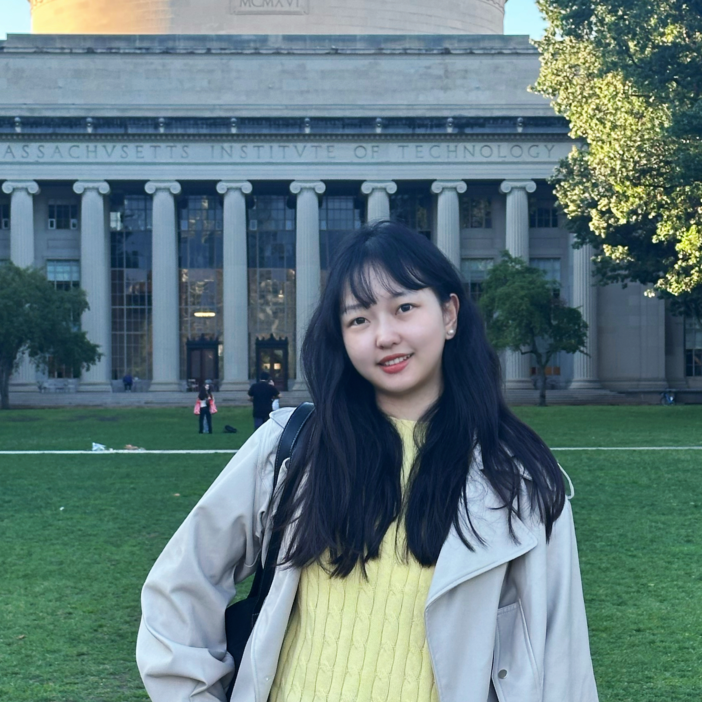

```{=html}
<style>
  #title-block-header, .quarto-title-block { display: none !important; }
</style>
<div class="site-shell">
  <div class="profile-sidebar" role="complementary" aria-label="Profile summary">
    
    <h1>Yiwen Zhang</h1>
    <p class="name-cn">张译文</p>
    <p class="role">PhD Candidate in Political Science<br>LSE Government</p>

    <div class="sidebar-links">
      <a href="assets/yiwen-zhang-cv.pdf" target="_blank" rel="noopener">Download CV</a>
      <a href="mailto:y.zhang539@lse.ac.uk">Email</a>
      <a href="https://www.linkedin.com/in/athena-yiwen-zhang" target="_blank" rel="noopener">LinkedIn</a>
    </div>
    <p class="cv-note">CV updated: September 2026</p>
  </div>

  <section class="main-content">
    <section class="intro-section">
      <p class="eyebrow">About</p>
      <h2>Researching inequality, welfare institutions, and technological change.</h2>
      <p>
        I am a PhD candidate in the Department of Government at the London School of Economics and Political Science (LSE), affiliated with the Data Science Institute and supervised by Professor Valentino Larcinese and Dr Pavithra Suryanarayan. I am fully funded as a first-cohort <a href="https://www.lse.ac.uk/study-at-lse/Graduate/fees-and-funding/enlighten-scholarship" target="_blank" rel="noopener">Enlighten Scholar</a>.
      </p>
      <p>
        Before joining LSE, I completed my M.Phil. and B.A. in Political Science (with joint honour program in Politics, Law, and Sociology) at Peking University.
      </p>
      <p>
        My research sits at the intersection of inequality, comparative political economy, computational social science, and AI governance. I study how welfare institutions and technological change shape economic insecurity, political demand, public opinion, and policy-relevant attitudes.
      </p>
      <p>
        As a first-generation university student from Sichuan, China, I also work on public initiatives that connect research with education equity, youth leadership, and inclusive technology. I was named to <a href="https://www.forbeschina.com/lists/1815" target="_blank" rel="noopener">Forbes China 30 Under 30 (2023)</a> in the Social Enterprise category.
      </p>
    </section>

    <section class="content-section selected-research">
      <div class="section-heading-row">
        <h3>Selected Research</h3>
        <a class="section-link" href="publications.html">View all research →</a>
      </div>
      <div class="item-list">
        <article class="list-item">
          <div class="item-index">01</div>
          <div>
            <h4>The Politics of Unequal Protection</h4>
            <p class="meta">Doctoral research project</p>
            <p>Three essays on welfare states, economic insecurity, and technological change.</p>
          </div>
        </article>

        <article class="list-item">
          <div class="item-index">02</div>
          <div>
            <h4>Multi-dimensional Bias in Modeling Multi-dimensional Preferences</h4>
            <p class="meta">Working paper / arXiv · 2026</p>
            <p>Evaluating whether LLM-generated synthetic agents can substitute for human respondents in conjoint experiments.</p>
          </div>
        </article>

        <article class="list-item">
          <div class="item-index">03</div>
          <div>
            <h4>Seeing beyond the negative</h4>
            <p class="meta">Policy report · University of Oxford Modern Slavery and Human Rights Policy and Evidence Centre / IOM UK · 2025</p>
            <p>An examination of variables in decisions not to formally recognise people as survivors of modern slavery.</p>
          </div>
        </article>
      </div>
    </section>

    <section class="content-grid-two">
      <section class="content-section compact-section">
        <h3>Teaching</h3>
        <div class="plain-block">
        <h4><a href="https://www.lse.ac.uk/resources/calendar2026-2027/courseGuides/GV/2026_GV101.htm" target="_blank" rel="noopener">GV101 Introduction to Political Science</a></h4>
        <p class="meta">Graduate Teaching Assistant · LSE · 2026–27</p>
        <p>Teaching two class groups for GV101, a core undergraduate course in political science at LSE.</p>
      </div>
      </section>

      <section class="content-section compact-section">
        <div class="section-heading-row">
          <h3>Public Work</h3>
          <a class="section-link" href="outreach.html">View outreach →</a>
        </div>
        <div class="mini-list">
          <p><strong><a href="https://www.linkedin.com/company/sheshapes" target="_blank" rel="noopener">SheShapes AI</a></strong><br><span>Co-founder; inclusive AI literacy and leadership.</span></p>
          <p><strong>World Economic Forum Global Shapers Community</strong><br><span>Global Shaper; Beijing Hub Curator; Youth Pulse Sub-Regional Steward.</span></p>
          <p><strong>Future Youth</strong><br><span>Co-founder; education equity initiative.</span></p>
        </div>
      </section>
    </section>

    <p class="last-updated">Last updated: September 2026</p>
  </section>
</div>
```
